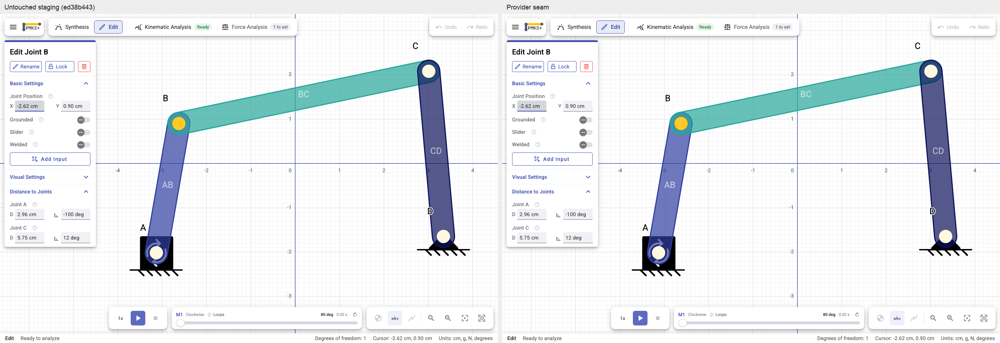
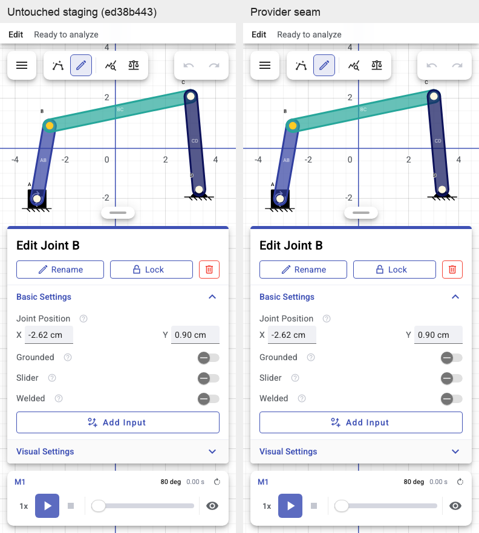

# Chrome provider seam

> **Status:** Partly built — PR A implements the legacy seam; review and merge are required before the native shell work resumes.

## Decision and ledger

The bodies-and-joints migration's **S5 is incomplete**. Draft
[PR #13](https://github.com/PMKS-Web/Planar-Mechanism-Kinematic-Simulator/pull/13)
remains open and must not merge before this seam. S6 has not started.

The separate `chrome-provider-seam` branch starts at staging `ed38b443`. Its sole purpose is
to let the existing chrome consume provider contracts without changing public behavior.
There is one `AppComponent` root, with the existing top strip, left panel, canvas, transport,
view controls, bottom bar and right drawer. No template, stylesheet, icon or rendering default
changes are part of this PR. No Fable review is requested for this work.

| Checkpoint | State |
| --- | --- |
| PR A: legacy provider seam | Implemented here; awaiting human review and merge |
| PR #13: rebase onto staging containing PR A | Waiting for PR A to merge |
| S5: native providers and existing canvas/Edit panel slots | Reopened; not accepted |
| S6: analysis/export/tutorial/default cutover | Blocked on corrected S5 acceptance |

## What the seam promises

`src/app/services/chrome/chrome-contracts.ts` contains the seven interfaces consumed by
`app-top-bar`, `app-left-tabs`, `app-playback-bar`, `app-view-controls`, `app-bottombar` and
`app-right-panel`. Scalar commands keep their existing types. Graph-valued readings expose
only the fields those components use; the chrome does not need a full `Mechanism`, `Joint`
or `Link` instance. Part references are passed back unchanged, not reconstructed from an id.

`chrome-tokens.ts` exposes typed injection tokens. Default factories resolve the existing
services, preserving TestBed and Storybook service overrides. `legacy-chrome-providers.ts`
uses `useExisting`, so the chrome and the canvas share the same singleton, settings streams,
selection and history. No service state is copied into a snapshot or wrapper.

`main.ts` selects the provider set before bootstrap can construct a loader. It always
bootstraps `AppComponent`. This PR installs only the legacy set, including when a development
URL requests `?editor=native`. `selectEditorProviders` can select a future installed native
set only on an explicit development request; production always selects legacy in this PR.
The test alternative is a marker provider, not a native runtime implementation.

Four existing representation-dependent operations move behind the services: finding the
input of a deferred partition, identifying a material link with mass, reporting the selected
link's raw hold, and the debug drawer's link redraw. Their predicates and effects are retained.
`MechanismService` remains the only implementation here, as requested. Its lint cap grows by
exactly the eleven executable lines moved from chrome queries; this is not new mechanism
behavior or permission to add more. Introducing another legacy adapter service merely to
avoid that move would defeat this PR's requirement to keep the existing implementations.

## What this does not yet promise

Overriding a chrome token does not construct that token's legacy default. It does **not**
prove that an entire native application is isolated: descendants and other services still
use the legacy document in this PR. In particular, the grid and Edit/analysis/setup/export
content, project URL loading/saving, tutorial/synthesis services, and the top bar's history
permission helper still need their migration work. The debug drawer also still reads legacy
static diagnostics. Do not hide these dependencies behind a second root or duplicate shell.

PR #13 must prove whole-application isolation before enabling its native provider set. Put a
throwing `MechanismService` factory on that route and exercise initial load, selection,
playback, history, project actions and drawer opening; merely resolving one token is not that
proof. Replace content in the existing slots and adapt remaining consumers in place.

## S5 and S6 follow-through after this PR merges

Rebase PR #13 onto staging. Provide native implementations behind this seam; the legacy
`MechanismService` must never be constructed on the native route. Render the native grid
and inspector in the existing canvas and Edit panel slots. Reuse `joint-colors.ts`,
`render-scale.ts`, the existing grid policy, registered SVG icons and 0.7 fill treatment.
Delete `native-editor.component.*`, including its duplicate chrome stylesheet.

S5 acceptance is a tracked paired comparison of the same fixture and flows on legacy and
native: identical chrome DOM and screenshots, plus paired S0 filmstrips inspected by a person.
It includes shadows, spacing, palette, wording, focus, transitions and reduced motion.
A passing native-only suite is not parity evidence. Necessary joint-pair/attachment controls
are the limited intended difference, not permission to redesign the surrounding app.

When the migration plan and progress ledger on PR #13 are updated after rebase, carry this
sequence into their S5 and S6 sections. S6 builds analysis and export inside the **existing
right drawer** and existing mode panels, never a copied native drawer. S7 removes obsolete
model code and redundant presentation, preserving reusable UI components.

## Validation

Artifacts are under `artifacts/chrome-seam/` in this worktree. The paired suite is
`e2e/chrome-provider-parity.mjs`, run with a second untouched staging server through
`PMKS_BASELINE_URL`; `e2e/README.md` records the command requirements. It must not be run in
a single-server CI lane pretending to compare two builds.

The baseline is an archived checkout of `ed38b443`, served independently. S0's historical
frames in PR #13 remain the flow reference; current staging supplies the regression baseline
so this seam does not undo later approved staging UI changes. The scenes include four-bar,
cylinder boom, Scotch yoke and three mechanisms; joint focus; coordinate edit and Undo;
context menu; subsection collapse/expand; playback; selected-joint phone sheet and reduced
motion. Static comparisons assert DOM, geometry and computed style equality, and a maximum
eight-level RGB pixel tolerance across the full screenshot. Two card-shadow pixels varied by four RGB levels between otherwise identical captures;
this small raster tolerance does not exempt any region from comparison. Motion sheets are inspected
separately: wall-clock capture frames are not claimed to be synchronized pixel comparisons.

The final PR description records the unit/build totals, five required browser suites,
paired screenshot results and live incognito observations. A later native route must run its
own paired gate; this PR's public-route result is not native visual acceptance.

Final local gate: **2,538 tests across 241 files**, production and Storybook builds, and
`npm run check` pass. The required `context-menu`, `right-drawer`, `two-mechanisms`, `mobile`
and `ui-copy` suites all pass. The final paired run has **50 matching states**, identical
chrome DOM/geometry/style, no browser errors, and maximum measured RGB delta **1/255**.

The historical S0 desktop focus frame retains the same visible presentation. Its phone frame
had part of the drawing behind the sheet; current staging frames that drawing above the open
sheet. Both independent current builds show that same behavior. The seam does not undo that
subsequent staging change to manufacture a match to the historical camera position.

Paired desktop and phone captures are retained below; the full images, difference images,
DOM records and motion sheets remain in artifacts. I inspected the four mechanism motion
sheets, subsection and phone-sheet intermediate frames, and the paired selected-joint states.
Live standard Codex computer use, in an incognito Chrome tab on `localhost:4327`, independently
verified library loading, play/pause/return, selection of B, X edit from -2.62 to -2.52 cm and
one Undo back to -2.62 cm, the joint context menu, project menu and Settings drawer.

