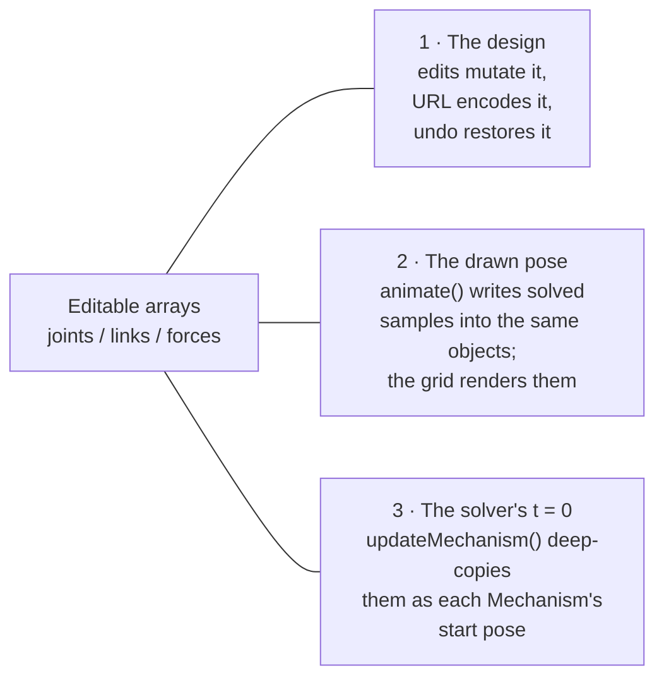
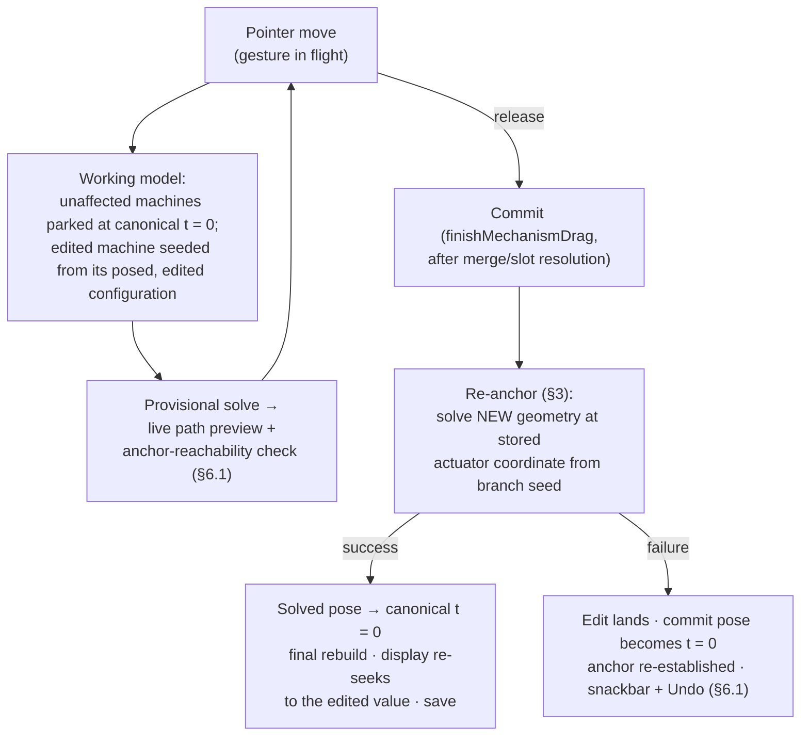

# Playback in Edit mode — softening the wall between editing and watching

**Purpose:** decide how PMKS+ can allow playback inside Edit mode, and later allow edits at any
paused pose, without corrupting the saved design, the undo history, or shared URLs.

**Status: all three phases are built.** This began as a planning document and is kept as the
record of *why* the code is shaped the way it is — the audit of what the code did before, the
design decisions, the trade-offs, and the build order. Read it that way: where it says "will",
it now describes what does happen.

Where the pieces live: `model/edit-permission.ts` and `services/edit-permission.service.ts` are
the permission model of §5.1; `model/mechanism/anchor.ts` is the anchor of §3;
`MechanismService`'s `beginPosedEdit` / `finishPosedEdit` and the `seedFromDisplay` skip inside
`restoreStartPose` are the staged transaction of §5.3. The gates are checked by
`src/tests/verification/posed-editing.spec.ts`, `e2e/edit-playback.mjs` (Gate 1) and
`e2e/posed-editing.mjs` (Gates 2 and 3).

Three rounds of adversarial review (GPT-5.6 sol) ran against the built phases and found
twenty-two defects between them, all fixed; the commit messages from `9970fde` onward name them
individually. The recurring one is worth knowing before touching this code: **a path that ends a
gesture without ending its staging leaves a machine seeded from its displayed pose**, and the
next ambient rebuild makes that the design. Three separate paths had it. **All three phases are
committed scope.** The phases exist to give the developer checkpoints — each ends in a gate
that proves the work so far is right — not to offer places to stop. No phase builds anything a
later phase tears out.

**Revision notes.**

- *Rev 2 (2026-08-30, user direction):* the transport is now permanent chrome (visible even on
  an empty grid — §5.1); throwaway interim work was removed and gates were added between
  phases; the touch audit is done and its behaviors decided (§5.4); a live anchor-reachability
  indicator was added to posed drags (§6.1); the history explanation was rewritten (§6.4).
- *Rev 1 (2026-08-29):* folded in an adversarial review (GPT-5.6 sol). Three findings changed
  the plan materially: (a) the first draft's anchor stored the full start pose and re-applied
  it exactly, which would erase any geometry edit — the anchor is now an actuator coordinate
  plus branch identity, and the new start pose is always *solved*, never copied (§3); (b)
  skipping `restoreStartPose()` re-zeroes **every** displaced machine, not just the edited one
  — posed edits are now a staged transaction (§5.3); (c) several "safe while displaced" edits
  were unsafe, undo does not land at the start pose on history continuation, and the
  deferred-solve path returns before saving — Phase 1 is strictly read-only while displaced,
  and two pre-existing bugs are filed separately (§2.6).

**Terms used throughout:**

- **t = 0 / start pose** — the pose the mechanism starts its cycle in. It is the only pose the
  URL format stores.
- **Displaced** — paused at any pose other than the start pose.
- **Machine** — one independently solvable mechanism inside the drawing. A drawing can hold
  several, each with its own clock (`ownSeconds`), play flag, and direction.
- **Actuator** — the driven joint, in the terms of
  [`model/actuator.ts`](../src/app/model/actuator.ts). Its **coordinate** is the driven
  quantity: angle for a pin, travel for a slider, extension for a cylinder.
- **Anchor** — the per-machine record of where the cycle starts (defined precisely in §3).
- **Ghost** — a faint skeleton of the start pose, drawn under the mechanism while displaced.
- **Transport** — the playback bar: speed, play/pause, stop, and the scrub rows.
- **DOF** — degrees of freedom. A machine runs when DOF = 1 and it has an input.
- **Toggle point** — a pose where the mechanism's motion reverses; two legs of the cycle share
  coordinates there and differ only in direction.

---

## 1. The problem

PMKS+'s best property is its feedback loop. Drag a joint and the traced path re-solves under
your hand, sixty times a second — the whole cycle, not a sketch of it.

That loop stops at a wall. To *watch* the mechanism move, you must leave Edit for an analysis
mode. To change anything, you must come back — and coming back rewinds the pose you were
looking at ([`selected-tab.service.ts#L125`](../src/app/selected-tab.service.ts#L125) eases
every machine to its start). A designer's real working loop — run it, spot the problem at the
pose where it happens, fix it *at that pose*, run it again — costs a mode switch and a re-scrub
per turn. The pose context is destroyed at the moment it is needed most.

**The proposal in one sentence:** make the playback transport permanent chrome, and allow
editing at any paused pose, while keeping the analysis modes read-only and the URL format
untouched. The wall that hurts is the transport being trapped inside analysis and editing being
trapped at t = 0 — not the mode separation itself.

---

## 2. What the code does today (the audit)

Read this section as a map of load-bearing walls. Every rigidity below protects something.

### 2.1 The one drawing is three things at once

The editable `joints` / `links` / `forces` arrays on `MechanismService` play three roles:

The whole mode boundary exists to keep role 2 equal to role 1 whenever role 3 is taken. That is
the job of [`restoreStartPose()`](../src/app/services/mechanism.service.ts#L4476): the first
act of every rebuild is to overwrite the drawn pose with sample 0. Without it, a rebuild at a
non-zero time would silently redefine t = 0 as wherever playback happened to be. **This "ratchet"
is the failure the architecture was built against. Any fluid-editing design must name it and
beat it.**

The restore overwrites more than coordinates.
[`applyMechanismPose`](../src/app/services/mechanism.service.ts#L4459) writes force magnitude,
direction, locality and endpoints, and each link's center of mass (CoM), back from solved
frames. An edit made to those properties while displaced can be erased by the very rebuild
meant to commit it. In this codebase, "non-geometric" does not mean "pose-independent," and
§5.2 no longer pretends it does.

### 2.2 The gates, and where they live

Several surfaces refuse edits:

| Gate | Where | Blocks |
| --- | --- | --- |
| `canEditNow()` | [`new-grid.component.ts#L1580`](../src/app/component/new-grid/new-grid.component.ts#L1580) | every canvas gesture while playing, displaced, or in Synthesis / analysis |
| `hideEditPanel()` | [`edit-panel.component.ts#L179`](../src/app/component/edit-panel/edit-panel.component.ts#L179) | swaps out the *entire* Edit panel while playing or displaced |
| `geometryLocked` | [`new-grid.component.ts#L3468`](../src/app/component/new-grid/new-grid.component.ts#L3468) | all movement in analysis modes |
| `canRestoreHistory()` | [`grid-utils.service.ts#L96`](../src/app/services/grid-utils.service.ts#L96) | undo/redo while animating or in analysis; both undo surfaces quote it |
| `freezeWhileRunning` | [`context-menu-builder.service.ts#L941`](../src/app/services/context-menu-builder.service.ts#L941) | greys context-menu editing rows mid-cycle, *with the reason* |
| `isAnimating()` | [`mechanism.service.ts#L294`](../src/app/services/mechanism.service.ts#L294) | `isPlaying \|\| !atStartPose()` — the only gate that sees per-machine clocks |

These gates do **not** all ask the same question. `isAnimating()` inspects each unsynced
machine's own clock through `atStartPose()`. The first, second, and fifth gates check only the
global step and play flag. Result: with machines unsynced, the master at zero, and another row
scrubbed away, the canvas and panel are editable today while undo correctly refuses. That is a
pre-existing bug (§2.6) and a warning — **do not build the new permission model on the current
gates.**

One asymmetry is worth keeping. The context menu *opens* everywhere and explains its refusals.
The Edit panel *vanishes*. The first is the pattern the codebase says it believes in ("every
greyed row quotes the model that enforces it"); the second predates it.

### 2.3 The transport is mostly portable

The playback bar sits in [`app.component.html`](../src/app/app.component.html) unconditionally.
Its template's first line, `@if (tabs.isAnalysisMode())`, is what confines it to the analysis
modes, and its rows are built from machine state, not analysis state. But "move the `@if`"
understates the port:

- The playback keyboard shortcuts carry their own analysis-mode gate
  ([`playback-bar.component.ts#L235`](../src/app/component/playback-bar/playback-bar.component.ts#L235)).
- On phones the scrub card is hidden. The transport there is play/pause/stop only — no precise
  way to park mid-cycle, on the platform where long-press and the bottom sheet already compete
  for space.
- A *deferred* drawing (§2.5) has no machines and an empty readiness list. The transport has
  nothing to quote for its greyed state and needs its own wording.
- Ungrounded geometry belongs to no machine and produces no row. The "why can't I play" answer
  for it lives in the mode chips, not the transport.
- The card animates in from the bottom edge on entry (`riseFromBottom`). That reads well when
  a mode brings its own controls; it must **not** fire when the drawing changes (§5.1).

### 2.4 The rebuild pipeline survives displaced poses — narrowly

[`updateMechanism()`](../src/app/services/mechanism.service.ts#L346) already holds the current
simulation time and re-seeks it after a rebuild, and holds each machine's own clock, play flag,
direction and reversal-compensation by identity (`heldEach`, keyed by `partitionKey`),
re-laying them onto whatever machines exist afterwards.

What is preserved is *elapsed seconds*, laid onto frames rebuilt **from canonical t = 0** —
because `restoreStartPose()` ran first. The machinery proves ambient rebuilds (unit changes,
scale changes) are pose-safe. It proves nothing about rebuilds seeded from a displaced pose,
which is exactly what posed editing creates: skip the restore, and *every* displaced machine's
shown pose becomes its provisional start before `heldEach` is consulted. That observation
drives the staged transaction in §5.3.

[`partitionKey`](../src/app/model/mechanism/mechanism-partition.ts#L71) deserves the same
caution. It is the lowest owned moving-joint id — built to survive reordering and deletion, not
to track topology lineage. Fuse machines A and B, and the union usually inherits one parent's
key; split a machine, and one child keeps it. Held clocks tolerate this (worst case, a wrong
resume point). An anchor must not silently inherit across a fusion (§6.3).

### 2.5 Other facts the design must respect

- **Deferred solving.** Above `SOLVE_IN_EDIT_UP_TO = 24` joints
  ([`mechanism.service.ts#L305`](../src/app/services/mechanism.service.ts#L305)), Edit mode
  does not solve at all. The deferred branch
  ([`mechanism.service.ts#L432`](../src/app/services/mechanism.service.ts#L432)) **returns
  before the save flag is honored and before any clock bookkeeping**. So there is no cycle to
  anchor against, and `updateMechanism(true)` mints no undo entry there (§2.6). The mode
  buttons run `solveNow()` behind the loading cover.
- **Undo/redo are URLs; URLs store only t = 0 — but restoration does not land there.**
  [`encodeFromStartPose()`](../src/app/services/mechanism.service.ts#L921) parks the drawing at
  t = 0 for every save, so the *format* speaks t = 0. Restoration re-seeks a held sample index
  after the rebuild ([`url-processor.service.ts#L250`](../src/app/services/url-processor.service.ts#L250)).
  §6.4 explains why that is harmless today and wrong in Phase 2.
- **Multiple machines.** "The pose" is plural. Anything phrased as "the crank angle" must be
  phrased per machine, in the actuator's own coordinate.
- **Branch identity is real machinery, not a tolerance check.** The position solver continues
  branches using prior positions and predicted direction. The drive-profile code needs a
  neighbor sample to tell the outward leg from the return leg at a toggle point, where the two
  legs share coordinates. Some mechanisms need two input revolutions to return to the same
  assembly branch. Any anchor that hopes to survive toggle-adjacent edits must speak this
  language (§3).
- **Drag already re-solves per pointer move.** `dragJoint` ends in `updateMechanism(false)`
  ([`grid-utils.service.ts#L489`](../src/app/services/grid-utils.service.ts#L489)). The live
  path preview is a full cycle solve at every pointer event. Playback-in-edit is not gated on
  solver cost for ordinary drawings; the problem is state semantics, not CPU.
- **Readiness is per machine and already user-facing**
  ([`readiness.ts`](../src/app/model/mechanism/readiness.ts) feeds the chips and setup
  drawers) — with the deferred and ungrounded gaps noted in §2.3.
- **The tutorial's climax is the mode wall.** Its final step tells the reader to enter
  Kinematic Analysis and press Play
  ([`tutorial-steps.ts#L297`](../src/app/model/tutorial-steps.ts#L297)), and completion
  requires the Kinematic tab. A play button in Edit competes with that lesson and cannot
  complete it. The tutorial changes *with* Phase 1, not after it.

### 2.6 Pre-existing bugs this audit surfaced (filed separately, not part of this plan)

1. **Deferred drawings skip saves.** The deferred-solve early return runs before
   `if (save) this.save()`. Mutations that rely on the flag — the weld/ground-style call sites
   inside MechanismService — create no undo entry on >24-joint drawings.
2. **The gates disagree when unsynced.** `canEditNow` / `hideEditPanel` / `freezeWhileRunning`
   check the global clock; `isAnimating()` checks every machine's. An unsynced machine scrubbed
   mid-cycle is editable on the canvas while undo refuses.

The first is an independent fix. The second is *absorbed by Phase 1*: the unified permission
model (§5.2) replaces the disagreeing gates outright, so it is fixed by construction rather
than patched first and replaced later.

---

## 3. The core design: what *is* the drawing?

Everything else falls out of one decision. The user pauses mid-cycle and nudges a joint. The
shown pose is now not the start pose. What happened to the design?

- **Reading A — "the drawing is what you see."** The displaced, edited pose becomes the new
  t = 0. Simple, and almost free to implement. And it is the ratchet: stop playback and you are
  somewhere new; share the URL and it opens somewhere new; every mid-cycle tweak quietly moves
  "start". For a tool whose users share URLs as homework, that reads as the app slowly losing
  your work.

- **Reading B — "the start pose is a bookmark the design keeps."** Each machine keeps an
  **anchor**. An edit at a displaced pose changes the geometry; the app then re-derives the
  start pose of the *new* geometry at the anchored input value. Stopping playback returns the
  input to the value the user originally drew. Only when the anchor is genuinely unreachable
  does the start pose change — and then the app says so.

This plan builds on Reading B.

**What the anchor is.** Per machine:

- the **actuator identity** — which joint is driven, in `actuator.ts`'s terms;
- the **actuator coordinate** at t = 0 — *stored*, never re-derived from samples. Storing it is
  what keeps repeated posed edits from drifting the start a fraction of a sample at a time;
- the **branch identity** — which leg of the cycle t = 0 sits on and which way it is headed,
  carried as a continuation seed (the t = 0 pose and its tangent or neighbor sample), in the
  form the position solver already uses to stay on a branch.

**What re-anchoring does.** Solve the **new** geometry at the stored actuator coordinate,
continuing from the branch seed — a targeted position solve, the same operation the solver
performs at every sample. The *result* becomes the new canonical t = 0. The stored pose is a
seed and a branch reference. It is **never re-applied as coordinates**: after a geometry edit,
the correct pose at the same input value has different coordinates by construction, so
re-applying the old ones would erase the edit or bend the links. (Edits made *at* t = 0 simply
redefine the anchor from the result — today's behavior, unchanged.)

**When re-anchoring fails.** The solve at the anchored coordinate finds no assembly (the input
value left the reachable range — a crank became a rocker), or branch continuation from the seed
cannot reach it (the anchor's leg no longer exists). Failure is detected by the solver's own
machinery, not by comparing coordinates against a stale pose. Pose equality is neither
necessary after a geometry change nor sufficient at a toggle point.

**Why eager re-anchoring keeps every compatibility surface intact.** At the end of each
committed edit, the editable arrays are physically placed at the newly solved anchor pose, and
the final rebuild runs from there. t = 0 *is* the anchor. The URL codec and the persisted
format are untouched. What is *not* free is history-restoration behavior (§6.4): format
compatibility is a constraint the design honors, not proof the design is sound.

---

## 4. Rigid vs fluid — the honest ledger

### What the rigid boundary buys (what we are giving up)

- **One invariant anyone can hold:** in Edit, what you see is the design. Students never wonder
  whether the panel's numbers are design values or a pose snapshot.
- **Trivially correct undo, URLs, and history** — all speak t = 0, and Edit never leaves it.
- **A small allowed-actions matrix.** The fluid version needs a genuinely larger table (§7),
  and every cell is a place to have a bug.
- **The graphs never lie**, because geometry cannot move while they are drawn. (Kept — analysis
  stays locked.)
- **Pedagogical sequencing:** "build here, watch there" is itself a lesson structure. The
  tutorial's finale depends on it today (§2.5).

### What it costs (why this plan exists)

- **The iteration loop.** Tweak → switch mode → wait → scrub to the pose → observe → switch
  back (pose destroyed) → tweak. Four to six interactions per turn of a loop the drag preview
  proves users want tight.
- **Pose-contextual editing is impossible**, and it is how mechanism design works: fix the
  transmission angle at the pose where it is worst; adjust the coupler at the limit position;
  set a link length so the follower clears an obstacle at the frame where it hits. Today each
  of those edits must be made at t = 0 while mentally projecting to the pose that matters.
- **The wall already leaks, deliberately.** Traced paths draw in Edit. Drag re-solves the
  cycle. The context menu opens mid-cycle and explains itself. `updateMechanism` grew machinery
  to survive ambient rebuilds at displaced poses. What is missing is the decision, not the
  precedent.
- **The transport is a teaching instrument** — speed, direction, reversal points, per-machine
  clocks — locked in the modes a first-year student reaches last.

### The synthesis

Fluidity *within Edit*; rigidity *between Edit and the analyses*. The analysis modes' contract
("these graphs describe this exact cycle") stays absolute, and `geometryLocked` stays.
Synthesis stays as-is. What changes: the transport becomes permanent chrome, and Edit's editing
gate relaxes from "paused at t = 0" to "paused" once the machinery of §3 and §5.3 exists.

---

## 5. The plan

Three phases, each ending in a gate. Everything built in one phase is load-bearing in the
next; nothing is interim scaffolding.

### 5.1 Phase 1 — the transport becomes permanent chrome

**Visibility is decided by mode alone — never by the drawing.** The transport renders in Edit
and both analysis modes, always, including over an empty grid. It is hidden only in Synthesis,
where playback has no meaning and entry eases to start anyway. Consequences:

- The `riseFromBottom` entry animation fires only on the Synthesis boundary — a deliberate
  mode change. Adding or deleting the first link never animates the bar in or out; the
  controls enable and disable *in place*.
- On an **empty grid** the transport is greyed and inert, with a quiet neutral hint ("Draw a
  mechanism to play it") rather than a readiness quote — there is nothing to be ready.
- On a drawing that exists but cannot run, the greyed state quotes `readinessOf()` where a
  machine exists to ask, with dedicated wording for the two cases §2.3 found where none does
  (deferred solve; only ungrounded geometry). The reason must not live only in a disabled
  button's tooltip — disabled elements do not reliably show tooltips, and touch has no hover —
  so the greyed card carries a visible one-liner.
- Rows appear per machine that runs, as today. On phones, the **shared scrub row returns**
  (compact) — pose selection is a Phase 2 dependency on every platform (§5.4), and building
  the phone transport without it would mean rebuilding it one phase later. Per-machine rows
  stay desktop-only.

**One permission source, built now.** Phase 1 introduces the `EditPermission` model — the
single object that answers "may this action happen, and if not, in what words" — and rewires
all six §2.2 surfaces to quote it. Its answers in Phase 1 are today's rules plus per-machine
correctness (asking `isAnimating()`-grade state, which fixes §2.6's bug 2 by construction).
Phase 2 then *changes the answers*, not the plumbing. This ordering exists precisely so no
gate is patched in Phase 1 and replaced in Phase 2.

**While playing or displaced, Edit is read-only. Fully.** Every mutation requires the
permission model's yes, and in Phase 1 it says yes only when the affected machine is paused at
its start. No exceptions carved out for "harmless" properties: `applyMechanismPose` overwrites
force properties and CoM from solved frames, the held-time machinery preserves elapsed
*seconds* (so a speed change moves the visible pose), and any allowed edit would contradict
keeping undo blocked. Properties become editable while displaced only in Phase 2, each arriving
with its canonicalization transform (§5.5) — built once, correctly, instead of shortcut now and
rebuilt later.

**The Edit panel stops vanishing.** `hideEditPanel()` dies. While playing or displaced, the
panel stays, fields disabled, with a slim banner whose text comes from the permission model —
*"Playing — pause to edit"* / *"Paused mid-cycle — return to the start to edit"* — and a
**Back to start** button that runs `easeToStart()`. In Phase 2 only the quoted strings change.
Watching a joint's coordinates tick during playback is a small teaching feature in itself.

**Deferred solve:** the play button renders enabled; pressing it runs `solveNow()` behind
`LoadingService.during('Working out the motion…')` — the top-bar's exact pattern — then plays.

**Mode-switch semantics, per edge.** Today the ease-to-start fires only when leaving an
analysis mode for a non-analysis mode; once Edit can play, that condition covers the wrong set:

| Transition | Pose | Playback |
| --- | --- | --- |
| Analysis → Edit | **kept** — scrub to the interesting frame, press Edit, still looking at it | pauses (arriving in an editable mode with things moving invites the fight §5.3 avoids) |
| Edit → Analysis | kept | keeps playing if playing; the graphs' playhead follows |
| Analysis ↔ Analysis | kept | kept (today's behavior) |
| anything → Synthesis | **eased to start** — new logic; the current trigger only fires when leaving analysis | stopped, `settings.animating` false |

Pausing on entry to Edit must cancel the queued playback frame, clear the frame clock, and set
the per-machine flags — the bookkeeping `easeToStart` does, minus the motion.

**Keyboard shortcuts:** the transport's gates widen from "analysis mode" to "transport
visible and usable", and Edit's arrow-nudge binding yields to transport keys exactly when
nudging is refused anyway — one predicate, from the permission model.

**The tutorial changes with this phase.** Its final step currently teaches the wall. Reword it
to teach the analysis mode for its graphs, and accept Play wherever it is pressed.

**Gate 1 — proof Phase 1 is right:**

- The transport is visible and inert over an empty grid; adding and deleting the first link
  produces no bar animation (E2E, measured).
- All six former gate surfaces quote `EditPermission` and agree — including the unsynced
  scrubbed-machine case that disagrees today.
- The §5.1 mode-switch table verified edge by edge (E2E).
- Phone shows the shared scrub row; [`e2e/mobile.mjs`](../e2e/mobile.mjs) extended and green.
- Tutorial completes with the reworded final step. Analysis modes regress nothing.

### 5.2 What Phase 1 deliberately does not do

No geometry edits while displaced, no anchor machinery, no undo changes. The permission model
refuses with reasons; the refusals are the same rules as today, stated better. This is the
checkpoint state: the transport lives everywhere, and nothing about the design's meaning has
changed yet.

### 5.3 Phase 2 — editing at any paused pose (the staged transaction)

The permission model's answers change: geometry gestures are allowed when the affected machine
is **paused** — anywhere. Playing remains read-only.

An in-place rebuild cannot host this: the rebuild is global, so skipping the restore would
turn every *other* displaced machine's shown pose into its provisional t = 0 — corrupting
machines the edit never touched. Posed editing is therefore a **staged transaction**:

1. **During the gesture** (per pointer move): the *unaffected* machines are parked at their
   canonical t = 0 in the working copy the solver reads, while the edited machine's
   posed-and-edited configuration seeds its provisional solve. Whether the working copy is a
   clone of the model, or the live arrays with the others restored first, is an implementation
   choice with real performance stakes — benchmark before promising the 60 Hz preview. The
   invariant is the same either way: **display time and canonical design pose enter the
   rebuild as separate inputs, and no machine's canonical pose is ever seeded from its
   displayed one.** The provisional cycle feeds both the path preview and the reachability
   indicator (§6.1).
2. **At commit** (`finishMechanismDrag` — which can first resolve a pending joint merge, so
   "commit" runs after the *whole* outcome is known, topology changes included): re-anchor per
   §3. On success, the solved pose becomes canonical t = 0 in the editable arrays, one final
   rebuild runs from it, the display re-seeks to the actuator value the user was editing at,
   and the save mints the undo entry (encoding t = 0, format unchanged). The user sees nothing
   move; the bookkeeping happens underneath.
3. **On failure** (no assembly at the anchor, or its branch is gone): the edit lands; the
   commit pose becomes the new canonical t = 0; the anchor is re-established from it; a
   snackbar says so — but the reachability indicator (§6.1) means this is never a surprise.

**Deferred drawings do not get posed editing.** The deferred path has no cycle to anchor
against, and "solve twice per commit" is the exact cost the deferral exists to refuse. At
t = 0 they edit as today. Displaced, geometry is read-only with the reason quoted ("Large
drawing — press Play to work out the motion, or return to the start to edit").

**Ships inside Phase 2, not after it:**

- **The start-pose ghost** — posed editing without it asks students to reason about a pose
  they cannot see, and it is the display surface of the reachability indicator (§6.1).
- **The anchor-reachability indicator** (§6.1).
- **"Set this pose as start"** — an explicit context-menu promotion of the current pose to
  t = 0. It makes the anchor a visible, controllable concept, and it is the honest counterpart
  of the automatic fallback.
- **History-restoration rework** (§6.4) — undo must stop re-seeking the held sample index
  before it may run from a displaced state.
- **Posed editing on touch** — the audit in §5.4 resolved the gesture conflicts; nothing about
  the transaction is pointer-type-specific.

**Gate 2 — proof Phase 2 is right:**

- The edit-survives test: re-anchoring after a lengthened link keeps the new length *and* the
  anchored actuator coordinate (the test the first draft's design would have failed).
- The ratchet sweep (§8.1) green: every ambient-rebuild trigger at a displaced pose leaves
  canonical t = 0 byte-identical.
- The neighbors test green: two-machine unsynced fixture, edit A displaced, B's canonical
  t = 0 and clock both survive.
- Indicator honesty: the reachability indicator's last state at release always matches the
  commit outcome — "reachable" commits re-anchor; "unreachable" commits fire the snackbar.
- Undo from a displaced pose returns to the restored drawing's start (§6.4).
- The new fixtures published in `FIXTURE_GALLERY` (§10).

### 5.4 The touch audit — one behavior on every pointer

Done now, as directed, so mobile and desktop ship the same capabilities. The conflicts and
their resolutions:

| Concern | Finding | Resolution |
| --- | --- | --- |
| Pose selection on phones | The scrub card is hidden below the breakpoint; phones cannot park mid-cycle precisely | The shared scrub row returns on phones in **Phase 1** (§5.1). Per-machine rows stay desktop-only; the shared row is what posed editing needs |
| Grab-to-pause vs long-press / tap / pinch | The gesture arbiter already exists: `pastDragThreshold` holds a drag while a press is undecided ([`new-grid.component.ts#L1608`](../src/app/component/new-grid/new-grid.component.ts#L1608)), and `LongPressDirective` owns the menu | **Pointer-down on a movable part while playing pauses at that frame, before the gesture is classified.** Then: drag → posed edit; tap → paused + selected; long-press → context menu on a now-paused machine (whose rows are no longer greyed "running"). Pinch never begins on a part. One rule, both pointers |
| Pointer-down on empty canvas while playing | Panning must not stop the show | Pan/zoom never pauses. Only a movable part is a grab |
| Alt-to-suppress-snap | No modifier exists on touch | Stays desktop-only — a pre-existing platform difference in a gesture *aid*, not a capability. Not a Phase 2 blocker: posed editing changes nothing about snap semantics |
| Accidental pauses from touch tremor | A finger is noisier than a mouse | The pause happens at pointer-down either way, and resuming is one tap on Play; no drag has begun until the threshold passes, so a tremor pauses but never edits |

Net: every capability in this plan — watch, scrub, pause mid-cycle, posed edit, menu,
Set-start — works identically on touch and mouse. The single desktop-only residue is Alt
snap-suppression, which predates this plan.

### 5.5 The Edit panel at a displaced pose — permission is not enough

Canvas gestures at a pose are *defined* to mean "put it here, at this pose" (§7.1 covers
whether students read them that way). Numbers are less forgiving; a single rule
("pose-invariant fields editable everywhere") dissolves on contact with the actual panel:

- **Joint X/Y and link angle** are pose coordinates. Display live; disable while displaced;
  tooltip quotes the reason; Back-to-start sits beside them.
- **Link length** *reads* pose-invariantly, but the current handler repositions joints using
  the displayed orientation — at a displaced pose that writes pose geometry. It needs its own
  canonicalization (apply the change along the link's t = 0 orientation) before it is enabled
  displaced.
- **CoM** is not simply link-local: the panel speaks grid-, joint-, and centroid-relative
  frames, and `applyMechanismPose` overwrites CoM from frames. Each frame needs its own
  transform to t = 0. Until written, CoM fields disable while displaced.
- **Forces:** a *local* force is link-attached and transplants; a *global* force's endpoints
  are world coordinates whose meaning at a displaced frame differs from t = 0. Different
  transforms, or disabled displaced.
- **Cylinders:** travel, start extension, and angle each mean something different; the sealed
  assembly is re-derived from its mounts by `normalizeSealedCylinders()` on *every* rebuild
  ([`mechanism.service.ts#L388`](../src/app/services/mechanism.service.ts#L388)); a mount edit
  at a displaced pose flows through that normalization. Cylinders get their own row in §7 and
  their own tests.
- **Welding at a displaced pose captures the displaced relative angle.** Arguably the feature —
  weld the parts the way they are posed — but a different design than welding at t = 0
  produces. It must be deliberate, documented behavior, and the re-anchor solve runs on the
  *welded* topology.
- **Locked links** already constrain dragging (rotate about one locked joint; refuse with two).
  The posed-drag pipeline inherits those constraints, and the re-anchor solve must respect
  locks the way the ambient solver does.

The unifying rule: **every property allowed while displaced needs a written canonicalization
transform to t = 0, not just a permission bit.** The `EditPermission` object answers *may this
happen*; a per-property transform answers *what it writes*. §7 specifies the first; the list
above is the work queue for the second. A property whose transform is not yet written stays
disabled-with-reason while displaced — a legal state, and the reason Phase 1 carves out no
early exceptions: each property unlocks exactly once, with its transform.

### 5.6 Phase 3 — grab-to-pause and anchor affordances

- **Grab-to-pause**, on every pointer, per the §5.4 rule: pointer-down on a movable part while
  playing pauses at that frame; the gesture then classifies as tap, drag, or long-press
  normally. This turns "pause, then edit" into one motion and is the last piece of the
  video-scrubbing instinct.
- **Anchor affordances** — the ghost as a click/tap target for Back-to-start; the transport
  marking the anchor on the scrub track.

**Gate 3 — proof Phase 3 is right:**

- Grab-to-pause verified on mouse and touch; long-press menus, pinch, and pan regress nothing
  (`e2e/mobile.mjs` extended).
- A grab during playback lands on exactly the frame shown at pointer-down (no drift between
  pause and gesture start).

---

## 6. Edge cases, worked through

### 6.1 The anchor becomes unreachable (crank → rocker and friends)

The user lengthens a link mid-pose. The input, formerly a full crank, now reciprocates between
limits that exclude the original start value. A mechanism's Grashof condition (whether its
shortest link can fully rotate) changes one edit away at all times — this is a mainline case,
not a corner.

**First line of defense: the user sees it coming.** Every pointer move already produces a
provisional solve of the whole cycle (§5.3), so whether the anchored actuator coordinate is
still inside the new cycle — on a compatible leg — is a **lookup into frames the preview
already computed, not an extra solve**. The result drives a live indicator on the ghost: while
the anchor is reachable, the ghost draws normally; the moment the dragged geometry can no
longer reach it, the ghost shifts to a warning state (dimmed amber, with a small "start
unreachable" tag). The state change is debounced a few frames so hovering at the boundary —
the edge of a crank's allowed geometry — does not flicker. The user can simply drag back until
the ghost recovers and release safely, undoing the overreach with their own hand instead of
meeting a popup after the fact. The per-move check is advisory; the commit's targeted solve
(§3) remains the authority, and Gate 2 holds the two to agreement.

**If the user releases anyway, the edit lands** — never refuse or revert a committed edit for
anchor reasons. The commit pose becomes t = 0, the anchor is re-established from it, and a
snackbar reports:

> *"M1 starts here now — its old start is out of reach."* — with Undo on the message, and the
> same fact kept on the transport row until the next transport action.
> **[Undo]**

Non-blocking, with Undo as the escape: the "restore" option *is* undo, because the old start
pose belongs to the old geometry, and the undo entry holds both. Evaluated only at commit,
never per pointer move. If the same gesture also fires merge/snap messaging, the anchor
snackbar yields: one message per gesture, structural news first. With the indicator and the
ghost ahead of it, the snackbar is narration of a change the user watched happen — not the
first notice.

### 6.2 The drawing stops being simulatable mid-cycle — by category, not by blanket

Operations differ in what they *mean*; one rule overfits the drag:

| Operation while displaced | Transaction semantics |
| --- | --- |
| Drag a joint / link | Pose-relative by definition — the pose you see is the truth of the gesture |
| Add a link / weld | Captures the displaced relative geometry — deliberate, per §5.5 |
| Delete a link/joint, toggle ground, change input | **Identity-addressed:** applies to canonical t = 0 without needing the displaced pose. Deleting a link at frame 40 must not freeze frame 40 into the design as a side effect |
| Rename, recolor, retrace | Identity-addressed, trivially |
| A drag whose release merges joints or cuts a slot | Starts pose-relative, *becomes* a topology change at commit — classified by its outcome, which is why commit runs after merge resolution (§5.3) |

When an **identity-addressed** operation breaks simulatability (delete the input's ground), the
displaced pose was never part of the edit. The design stays at canonical t = 0, the machine
stops running, its transport row disappears (the bar itself stays — §5.1), and — with no cycle
left to display the displaced pose from — the drawing is shown at its start pose, eased. When
a **pose-relative or capturing** operation does it, the commit pose is the only consistent
geometry there is, and it becomes the drawing; the anchor for that machine is dropped, and the
old drawing is one Undo away. The readiness quote on the greyed transport explains what is
missing to run again.

### 6.3 Several machines, one edit

Machine A is edited at a displaced pose while machine B sits elsewhere in its own cycle. B's
canonical pose is never seeded from its display (the §5.3 invariant), and B's clock survives
via `heldEach`; only A re-anchors. An edit that *fuses* A and B produces a partition whose
`partitionKey` usually matches one parent (§2.4) — so anchor carry-over cannot key on
`partitionKey` alone. The anchor map carries a topology signature (the owned-joint set is
enough), and **fusion or splitting invalidates the inherited anchor**: the fused machine
re-establishes its anchor from the commit pose — one snackbar, not two. Same on a split, for
both children. Held *clocks* keep their looser keying: a wrong resume point is a nuisance; a
wrong anchor is a corrupted design.

### 6.4 Sharing and history while displaced

**Sharing** is already correct. `encodeFromStartPose` parks every machine at t = 0 to encode
and restores after, so a URL copied mid-cycle opens at the start pose. Unchanged; worth one
line in the share affordance ("links open at the start pose").

**History** needs a deliberate change. Step by step:

Undo and redo work by replaying saved URLs, and a saved URL stores the drawing at its start
pose only. So you might expect undo to always land at the start pose. It does not. The restore
code does three things
([`url-processor.service.ts#L250`](../src/app/services/url-processor.service.ts#L250)):

1. It notes which sample index the drawing is currently showing (say, sample 40).
2. It rebuilds the drawing from the saved URL — at that drawing's start pose.
3. It then jumps the rebuilt drawing forward to sample 40 again.

Today, step 3 never does anything, because undo is only allowed while parked at the start —
the noted index is always 0. The jump is a loaded gun that present rules keep unloaded.

Phase 2 changes the rules: undo becomes legal while paused at sample 40. Now step 3 fires,
and it is wrong twice over. First, "sample 40" belonged to the *edited* drawing's cycle; the
restored drawing is older geometry with a different cycle, which may not even have 40 samples,
so the jump lands on an unrelated pose. Second, the jump moves only the shared clock —
unsynced machines' own clocks are not restored at all.

**Decision: undo rewinds.** When you undo, you get the older drawing at *its* start pose,
eased there rather than cut. Step 3 is removed for history restores. All in-memory anchors are
dropped and re-read from the restored drawing — a history or URL load is authoritative, and no
anchor outlives it. In short: **pose is not part of history; edits are.** The rejected
alternative — replaying the restored drawing to "the equivalent pose" — would sometimes be
helpful and sometimes be baffling; predictable beats clever.

### 6.5 Analysis modes during all of this

Unchanged, deliberately. Geometry locked, transport as today. The one interaction: §5.1's
"pose survives the switch" means entering an analysis mode from a displaced Edit pause starts
the graphs' playhead at that pose — which the graphs already handle, since the transport
scrubs freely today.

---

## 7. What is allowed when — the matrix

The `EditPermission` object's specification — built in Phase 1 on per-machine
`isAnimating()`-grade state, never the global step. Legend: ✅ allowed · 🔶 allowed once its
§5.5 canonicalization transform exists (until then: disabled with reason) · ⛔ refused with
quoted reason · — not applicable.

| Action | Edit · paused at start | Edit · paused displaced | Edit · playing | Analysis (any) | Not simulatable | Solve deferred |
| --- | --- | --- | --- | --- | --- | --- |
| Select / inspect / pan / zoom | ✅ | ✅ | ✅ | ✅ | ✅ | ✅ |
| Drag joint / link (geometry) | ✅ | ✅ *Phase 2, at pose* | ⛔ pause first *(Phase 3: grab pauses)* | ⛔ locked | ✅ | ✅ at start · ⛔ displaced (§5.3) |
| Add link / weld | ✅ | ✅ *Phase 2, captures pose (§5.5)* | ⛔ | ⛔ | ✅ | ✅ at start only |
| Delete / ground / change input | ✅ | ✅ *Phase 2, identity-addressed (§6.2)* | ⛔ | ⛔ | ✅ | ✅ at start only |
| Joint X/Y, link angle by number | ✅ | ⛔ shown at pose (§5.5) | ⛔ | ⛔ | ✅ | ✅ |
| Link length by number | ✅ | 🔶 needs t = 0-orientation transform | ⛔ | ⛔ | ✅ | ✅ |
| Mass, CoM, force magnitude/direction | ✅ | 🔶 per-frame transforms (§5.5) | ⛔ | ⛔ | ✅ | ✅ |
| Cylinder travel / extension / angle | ✅ | 🔶 own semantics + normalization (§5.5) | ⛔ | ⛔ | ✅ | ✅ |
| Name / color / trace | ✅ | 🔶 with its transform (§5.5) | 🔶 same | color/trace only (today's rule) | ✅ | ✅ |
| Input speed / direction | ✅ | ⛔ moves the visible pose (§5.1) | ✅ via transport (its own held-time path) | ✅ (transport) | — no input | ✅ at start |
| Play / scrub / stop | ✅ | ✅ | ✅ | ✅ | ⛔ readiness quoted · empty grid: neutral hint (§5.1) | press = solve behind cover, then ✅ |
| Undo / redo | ✅ | ✅ *Phase 2, after §6.4 rework* | ⛔ pause first | ⛔ (today's rule) | ✅ | ✅ |
| Share URL / export | ✅ | ✅ (opens at start) | ✅ | ✅ | ✅ | ✅ |
| Mode switch | ✅ | ✅ pose kept (§5.1 table) | ✅ per §5.1 table | ✅ | chips explain | solve behind cover |

Every ⛔ and 🔶 carries words, and the words come from one place per rule — the permission
model, extending the pattern the context menu already established.

### 7.1 The student's mental model (why several cells are stricter than they could be)

A first-year student who grabs a joint of a paused, displaced mechanism can reasonably mean
three different things:

1. "Move the mechanism along its motion" (scrubbing).
2. "Pin this point here at this frame" (a constraint).
3. "Redesign the linkage" — the only one the app will actually do.

The mitigations, in order of load-bearing: the **ghost** keeps the design's start visible, so
"I am reshaping the machine, not posing it" has a picture — and its reachability state (§6.1)
shows the consequence *during* the gesture; the panel banner names the state; **Set start**
makes the implicit thing explicit; the snackbar narrates what was committed. Snap adds a
wrinkle: snapping a joint at a displaced frame puts the *pose* on grid, and the re-anchored
t = 0 will generally be off-grid. Accepted — snap is a gesture aid, not a design invariant —
but it belongs in the tutorial's Phase 2 material, and it is one more reason the
numeric-placement fields stay t = 0-only. If usability testing shows the three-way ambiguity
still bites with all mitigations shipped, the adjustment is to require the explicit "Set this
pose as start" step before posed *dragging* — a gate on the same machinery, not different
machinery — so nothing built here is discarded either way.

---

### 7.2 The audit, run (September 2026)

`e2e/posed-edit-audit.mjs` tries every cell of the "paused displaced" column the app actually
offers -- every context-menu row on a joint, a link, a force and the canvas, every Edit-panel
field, the keys and the transport, on a four-bar, a slider-crank and a cylinder -- and judges the
state each one leaves behind rather than what it did. Its table is written to
`artifacts/posed-edit-audit/matrix.md`. What the first run found, and what changed:

| Finding | Class | Fix |
| --- | --- | --- |
| A tracer point, a force, or a slider made at a displaced pose rebuilt directly; the restore put every other joint home and left the new part where the hand had put it (a point half a mechanism off its coupler; a "dangling-slider" from one click) | Capturing edit not staged (§6.2) | `addJointAt`, `createForce` and `toggleSlider` stage themselves through `capturingPose`, as `weldJoint` already did; the force gesture's press names its link as the anchor part |
| A staged edit that changed the owned-joint set -- a part drawn from a joint, a drop that merged two joints -- lost the machine's anchor: the key changed, a fresh anchor was read from the provisional cycle's sample 0 (the displaced pose), and the settle could not find the machine. The start quietly became the pose under the hand | Anchor identity | Anchors are carried across a reshaped machine (`carriedAnchorFor`: same driven joint, same rule, the only anchor those joints hold), and the staged machine is resolved by its joints, not its key |
| A release that could not re-anchor ran no rebuild, so the amber ghost, its "Letting go moves the start here" pill, and the machine's clock all stayed as the drag had left them; the stale step was then encoded into the history and redo landed a different pose | Commit bookkeeping | `startWhereItStands`: the commit pose is the start, so the machine's clock and the shared step are zeroed through the ordinary seek and the ghost cache is dropped. The pill is drawn only while a gesture is staged |
| Every Edit-panel handler asked the *placement* question, so the toggles the freeze leaves live away from the start -- Grounded, Driven Input, Slider, Weld, Trace, the masses -- flipped on screen and wrote nothing | Panel gate | Those handlers ask `structure` |
| Deleting what an edit made -- a tracer point, a force -- while still displaced left every link body at the start pose with its pins two seconds on. Not a posed-editing bug at all: a solved sample's outline was being realized lazily from the *live* source link (the drag-performance work), after the display had moved that link's joints and rewritten its path, so the rigid move collapsed to the identity and bodies lagged their pins by a frame in playback and by a whole jump after any seek | Display | The sample snapshots the source's path and pin coordinates when it is made (`link.ts`); the sweep's "links drawn where their pins are" invariant is what now guards it |
| Undo after a displaced edit landed on a drawing standing at its start with the shared step still reading the sample the entry was saved at: the transport said a third of a turn, the pose said zero, and the permission model believed the transport. The history restore had stopped re-seeking (§6.4) but the codec still restored the step | History | A history restore never restores the playhead; the number stays in the format and is ignored (`url-processor.service.ts`, `mechanism-builder.ts`) |
| After a drag at a displaced pose that changed the machine's cycle, the ghost sometimes drew a third of a turn from where the transport said the start was, or the start "moved" with no cause. The re-anchored sample 0 is a pose interpolated between two solved samples, and a point part-way along a chord is not at the part-way angle: the coordinate read back off it is a few thousandths of a degree from the stored one, which the anchor lookup rejected as outside the first sample's interval, and the whole-turn fallback then saw a value already in range and gave up | Anchor lookup | `reachAnchor` accepts a crossing a hundredth of a sample outside an interval and clamps it (`anchor.ts`); found by fuzzing random drags at random poses (`e2e/posed-drag-fuzz.mjs`) |
| Pose-independent, found on the way: grounding a slider's pin minted three entries (the slot-angle control's enable/disable emission was handled as a typed angle); the cylinder's Driven Input row rebuilt without saving | History | The angle handler ignores a disabled control and the value it is already showing; the cylinder toggle saves |

The 🔶 cells stand: joint X/Y, link length and angle, CoM, force fields, cylinder fields and the
input speed are refused while displaced, with the banner quoting why, and the sweep records each as
refused with words. Writing their canonicalization transforms (§5.5) is still the way to unlock
them; nothing in the sweep changes when one is written except that its row moves from *refused* to
*ok*.

## 8. Risks, named

1. **The ratchet returns.** The design stands on the §5.3 invariant — no machine's canonical
   pose is ever seeded from its displayed one. The regression test drives every *actual*
   ambient-rebuild trigger at a displaced pose (object-scale change, unit conversion,
   gravity/grid toggles, force normalization, history load, cylinder normalization — **not**
   merely opening Settings, which has been a no-op since the panel's `skip(1)`
   ([`settings-panel.component.ts#L97`](../src/app/component/settings-panel/settings-panel.component.ts#L97)))
   and asserts canonical t = 0 unchanged to the digit.
2. **Anchor corruption beats anchor drift.** Drift is handled by storing the actuator
   coordinate. The live risks are branch mis-continuation at toggle points (§3's seed exists
   for this) and lineage inheritance across fusion/split (§6.3's invalidation rule). Both need
   dedicated fixtures.
3. **State-matrix bugs.** §7 is fourteen actions × six states, and the *current* three-gate
   system already disagrees (§2.6). The single permission source built in Phase 1 is the
   mitigation; every new surface must quote it rather than re-deriving.
4. **Performance.** The staged transaction adds work per pointer move (parking unaffected
   machines, or cloning) plus the reachability lookup, and one targeted solve per commit.
   The lookup is a range check on frames the preview already computed; the transaction itself
   must be benchmarked on the 45-joint stress drawing before the 60 Hz preview is promised.
   The deferred-drawing exclusion (§5.3) is the pressure valve.
5. **Conceptual load on students.** §7.1 carries the argument, and its fallback is a gate on
   the same machinery rather than a retreat from it.

---

## 9. Open questions (decide before Phase 2)

- **Tutorial depth.** §5.1 settles the final step. Does `progressFor` need a full audit against
  displaced poses (each predicate reads the live arrays), or does gating the tutorial card on
  `atStartPose()` suffice?
- **Staging strategy.** Clone-per-gesture vs restore-others-first in the live arrays (§5.3) —
  decide with the benchmark, not by taste.
- **Does the corner card (Undo/Redo ↔ Export Data) change?** Likely no, but the swap logic
  references mode, not state, and should be re-read once §7 lands.

---

## 10. Keeping it verified

- **Unit:** anchor establish / carry / invalidate rules, including fusion and split (§6.3);
  the edit-survives re-anchoring test (Gate 2); branch continuation at a toggle-adjacent
  anchor, built from a fixture whose two legs share coordinates; the reachability lookup
  agrees with the commit solve across the fixture set; the §6.2 category table, one test per
  row; each §5.5 canonicalization transform as it is written.
- **Regression, the ratchet:** the §8.1 trigger sweep at a displaced pose; canonical t = 0
  byte-identical after each.
- **Regression, the neighbors:** two-machine unsynced fixture; edit A displaced; assert B's
  canonical t = 0 and clock both survive.
- **End-to-end (E2E) tests** ([`e2e/`](../e2e/README.md), Playwright): the Gate 1 list
  (empty-grid transport with no bar animation, permission-source agreement, mode-switch table,
  phone scrub row, tutorial); pause mid-cycle → nudge → stop returns the input to the anchored
  value; drag toward non-Grashof territory → ghost flips to warning → drag back → release →
  **no** snackbar; release while warned → snackbar → Undo restores; delete ground mid-pose →
  eased to start per §6.2, transport quote explains; drag mid-pose then delete → commit pose
  kept per §6.2; deferred-solve play press shows the cover then plays; grab-to-pause on mouse
  and touch (Gate 3).
- **Fixtures:** new `FIXTURE_GALLERY` entries for the crank-that-becomes-a-rocker, the
  toggle-adjacent anchor, and the two-machine unsynced case, so every scenario above is a
  clickable URL per the house rule.

---

## 11. Summary of the proposal

| Decision | Choice |
| --- | --- |
| Transport visibility | Permanent chrome in Edit and both analyses, empty grid included; decided by mode alone, never by the drawing; hidden only in Synthesis |
| Editing while playing | No — pause first; Phase 3's grab-to-pause makes grabbing pause, on every pointer |
| Editing while paused displaced | Yes — Phase 2, as a staged transaction; gestures pose-relative, structural deletes identity-addressed, numeric fields per-property (§5.5) |
| What t = 0 means | A per-machine **anchor**: actuator identity + stored coordinate + branch seed; re-anchoring **solves** the new geometry there — the old pose is a seed, never re-applied |
| Anchor at risk mid-drag | The ghost warns live (§6.1), so the user can drag back; releasing anyway lands the edit, moves the start, and the snackbar narrates with Undo |
| Simulatability lost mid-pose | By operation category (§6.2): identity-addressed edits keep canonical t = 0; pose-relative ones keep the commit pose |
| Touch | Full capability parity per the §5.4 audit; the only desktop-only residue is Alt snap-suppression, which predates this plan |
| Analysis modes | Unchanged, still read-only; pose survives the mode switch |
| URL format | Untouched — eager re-anchoring keeps t = 0 the only persisted pose. Undo rewinds to the restored drawing's start (§6.4) |
| Build order | Phase 1: transport everywhere + one permission source (Gate 1) → Phase 2: anchor, staged transaction, ghost + indicator, Set-start, history rework (Gate 2) → Phase 3: grab-to-pause, anchor affordances (Gate 3). No phase builds anything a later phase removes |
