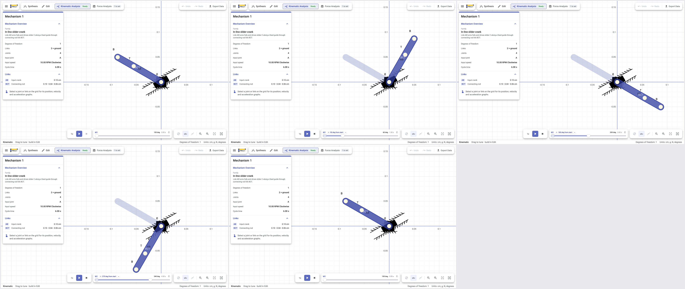
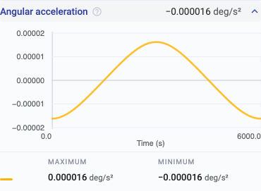

# Mechanism audit fixes

> **Status:** Reference — decisions and regression coverage for the 68 user-facing findings from the October 2 audit.

The retained reproduction payloads are in `src/test-utils/verification/audit-fixtures.ts`,
with clickable links in [fixture-urls.md](fixture-urls.md). Finding #50 is excluded: it exercises
paused unit conversion through an API path the Settings UI prevents. The other IDs, #1–69,
are all in scope. The table below is an acceptance ledger, not a count of passing CI checks.

## Decisions

- Keep floating-point solved poses and graph data. Round at presentation and file-format boundaries.
- Normalize geometric mobility's angular rows and residuals by characteristic length. A counted
  zero still permits genuine redundant motion; an immobile welded drawing must not deform.
- Reject rank-deficient differentiated systems and use the recorded trajectory on its selected
  branch for missing rates. Stencils never cross a commanded reversal. Where too few branch
  samples exist, leave a gap. An ideal instantaneous reversal has no ordinary finite acceleration;
  one-sided sampled limits describe each adjacent branch. Grounded pin rates stay exactly zero.
- Transfer welded member rates from the parent rigid body, and cylinder interior rates from the
  mounts and axis. Linear positions are model-scaled; angular positions are degrees and angular
  rates are radians. Reversal negates velocity and keeps acceleration at the same pose.
- Assemble force balance in SI, including moment arms and linear inertia. A floating motor applies
  equal and opposite torque to its driven and reference bodies. Each machine prepares its own
  solver context before dynamic force reads.
- Extend the existing URL body with optional precise `P` records rather than reinterpreting old
  numeric tokens. Existing URLs decode under their original rules; new readers restore exact
  finite numbers before rebuilding. Old readers reject the new tag instead of silently loading
  coarse geometry or default speeds. Values already lost in old URLs cannot be inferred reliably;
  use the published source control to verify a fresh save.
- Try the coupled position solve before bounded startup step reduction. Restore the pose on
  each retry and use accepted input travel to advance the clock. Do not relax rigid constraints.
- Default reversed plots, graph markers and CSV to the displayed elapsed clock. Reuse solved
  geometry while ordering samples in playback direction.
- Attach loads physically to their root body while retaining `anchoredTo` member identity for
  selection, saving and unwelding. Use the solving machine's transform for paused attachments.
- Recognize Jansen legs by the connected upper/lower triangles and their connecting bars before
  comparing normalized dimensions. Cylinder-driven lever explanations require an actual driven,
  unfrozen cylinder with stationary mount and a lever pivot.

## Regression evidence

All test paths below are under `src/tests/verification/` unless noted otherwise.

| Suite | Scope |
| --- | --- |
| `mechanism-audit.spec.ts` | Exact inventory; invalid mobility; member angles; ground and change-point rates; force SI and floating-motor power; reversal signs; independent acceleration and cycle controls; family negative controls |
| `mechanism-audit-save.spec.ts` | Production unit conversion and fresh URL encode/decode for all 11 save findings, including both speed signs and physical force/inertia effects |
| `mechanism-audit-startup.spec.ts` | All nine startup findings; all-frame rigid lengths and guide constraints; converted units and independent stroke periods; #1 scale controls |
| `mechanism-audit-interactions.spec.ts` | Actual graph datasets and reversed CSV/marker; immediate load participation, saved member identity and unwelding; paused member tracer; rotated/scaled genuine Jansen controls |
| `src/app/services/transcoding/precise-values.spec.ts` | Legacy payload decoding, exact numeric round trips and malformed extension rejection |
| Existing force, MATLAB, fixture, template, mobility and cycle suites | Compatibility controls beyond the audit reproductions |

## Browser evidence

`e2e/mechanism-audit.mjs` opens the retained #1, #58, #64 and #68 payloads in a
fresh browser context. It checks rejected immobile geometry, #64's full six-second
cycle and stationary slider, the independently expected nonzero peak in the actual
angular-acceleration graph, and the Jansen negative control. It captures the cycle
quarters and the small graph for visual review.

## Acceptance ledger

Each finding has exactly one primary category. Secondary dependencies are described in the sections above.

| Findings | Primary category | Acceptance evidence |
| --- | --- | --- |
| #1 | 7. Invalid motion | Reject the immobile drawing; preserve rigid distances and genuine redundant-motion controls across scales |
| #2–4 | 8. Rates and change points | Ground rates exactly zero; moving-body branch limits agree with independent motion |
| #5 | 1. Force equations | Rotating-bar ground reaction agrees with physical Newton–Euler balance in cm, m and in |
| #6–7 | 5. Saved precision | Rotated redundant drawings retain one freedom and their motion after reopening |
| #8–21 | 3. Angular units | Member bearing agrees with geometry in readings, plots and exported rows |
| #22 | 8. Rates and change points | Ground pin G has exactly zero velocity and acceleration throughout the solved cycle |
| #23 | 1. Force equations | Floating motor applies equal and opposite torques and satisfies virtual work |
| #24 | 2. Analysis context | Dynamic forces agree regardless of which independent machine is read first |
| #25 | 8. Rates and change points | Whole-body rates use the same reversal convention and preserve rigid rod length |
| #26 | 1. Force equations | Isolated angular-inertia contribution agrees with independent input power |
| #27 | 3. Angular units | Vertical bracket bearing is −90 degrees, with consistent angle-unit conversion |
| #28 | 5. Saved precision | Exact guide direction and runnable mobility survive saving |
| #29 | 8. Rates and change points | Translating coupler derivatives agree with crank geometry; grounded rates stay zero |
| #30 | 3. Angular units | Both welded rod members report their actual bearings |
| #31 | 5. Saved precision | Meter-converted gripper remains runnable after save/reopen |
| #32–36 | 6. Startup sampling | Production unit conversion preserves valid travel, physical shape and cycle time |
| #37 | 5. Saved precision | Inch-converted hood hinge remains runnable after save/reopen |
| #38–39 | 5. Saved precision | Mass and custom inertia retain their physical values and analysis effects |
| #40–43 | 5. Saved precision | Small nonzero speeds, both signs and periods survive a fresh reload |
| #44–46 | 1. Force equations | Floating-input load cases satisfy independent virtual work throughout valid branches |
| #47–48 | 8. Rates and change points | Scissor accelerations agree with exact geometry near folded poses |
| #49 | 2. Analysis context | Reversal changes every velocity sign while preserving acceleration at the same pose |
| #50 | Excluded API diagnostic | Decide API support separately; no additional confirmed UI finding |
| #51 | 8. Rates and change points | Welded leaf CoM derivatives agree with its parent's rigid-body transfer |
| #52–54 | 1. Force equations | Floating-input load cases satisfy independent virtual work |
| #55–57 | 6. Startup sampling | Narrow valid strokes start, remain on the nearby branch and complete their expected cycles |
| #58 | 3. Graph precision | Small nonzero angular acceleration remains nonzero in both angle-unit graph datasets |
| #59 | 4. Member attachments | New member force immediately loads and follows the owning body; reopen and unweld preserve intent |
| #60 | 4. Member attachments | Paused member tracer appears at the requested world point without shifting existing geometry |
| #61 | 2. Analysis context | Playback clock, graph marker and exported elapsed-time rows describe the same reversed pose |
| #62 | 6. Startup sampling | Narrow Peaucellier motion starts and preserves inversion and bar constraints |
| #63 | 8. Rates and change points | Straight-line output acceleration agrees with independent inversion geometry |
| #64 | 9. Cycle continuation | Both directions close a six-second cycle while retaining the stationary-slider branch |
| #65 | 8. Rates and change points | Passive seal acceleration agrees with differentiated mount/axis geometry |
| #66 | 10. Explanations | Frozen cylinder is not named as the actuator; actual grounded input is identified |
| #67 | 8. Rates and change points | Rocker angular acceleration agrees with clean circle geometry, using meaningful absolute tolerance |
| #68 | 10. Explanations | Reject independent four-bar banks as Jansen legs while retaining genuine connected Jansen controls |
| #69 | 8. Rates and change points | Constant-speed radial rod has zero angular acceleration on the stationary-slider branch |
